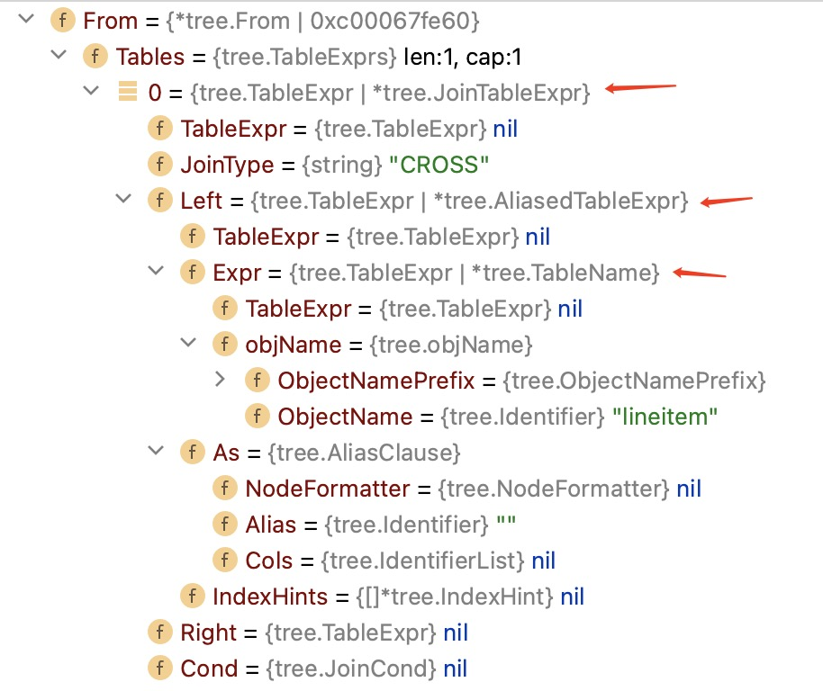
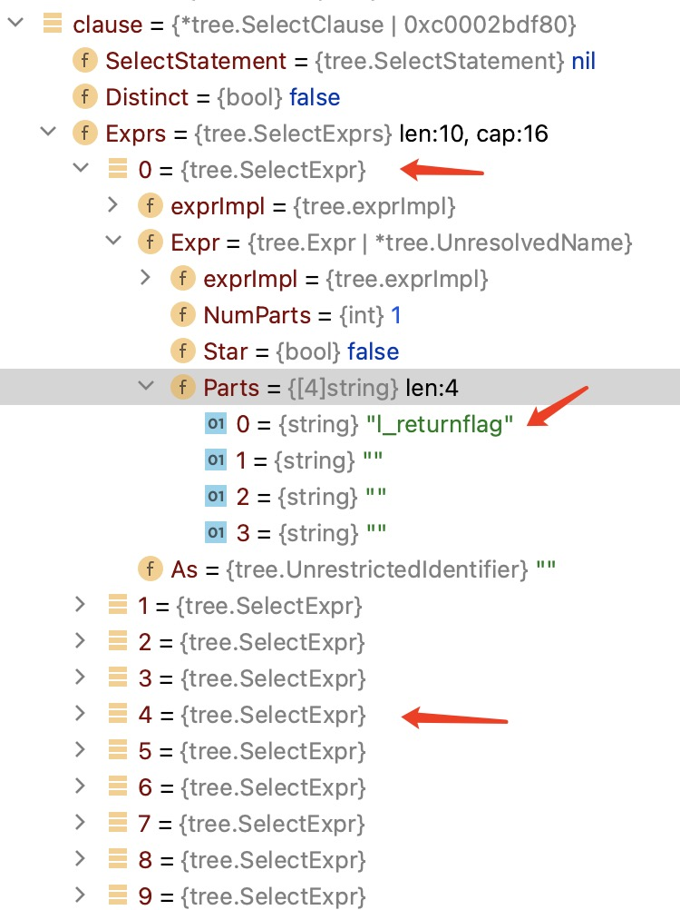
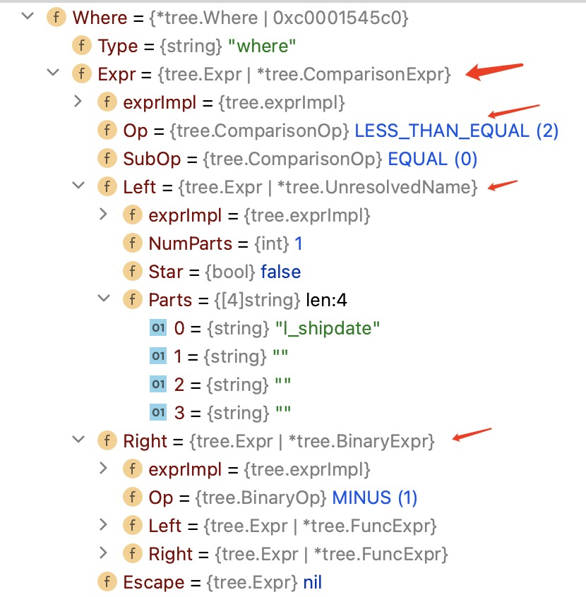
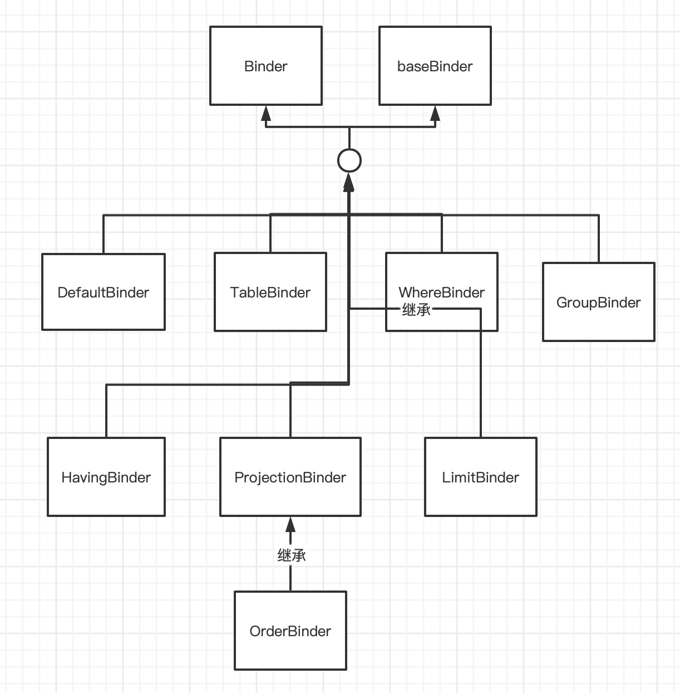

# 第一章 单表

讲述tpch q1的plan构造过程中相关的逻辑和数据结构。

对于逻辑部分，专注在于主干逻辑、关键细节。不会解释每行代码，每个if语句。

对数据结构，按需、逐步的解释用到的数据数据中的必要字段。不会一次性解释全部字段。

q1 单表。无子查询。有聚合函数，group by和order by。有过滤条件。

```sql
select
    l_returnflag,
    l_linestatus,
    sum(l_quantity) as sum_qty,
    sum(l_extendedprice) as sum_base_price,
    sum(l_extendedprice * (1 - l_discount)) as sum_disc_price,
    sum(l_extendedprice * (1 - l_discount) * (1 + l_tax)) as sum_charge,
    avg(l_quantity) as avg_qty,
    avg(l_extendedprice) as avg_price,
    avg(l_discount) as avg_disc,
    count(*) as count_order
from
    lineitem
where
    l_shipdate <= date '1998-12-01' - interval 112 day
group by
    l_returnflag,
    l_linestatus
order by
    l_returnflag,
    l_linestatus
;
```

### 数据结构

#### Binding

```go
// tag -> nodeId, table
type Binding struct {
    tag         int32
    nodeId      int32
    table       string
    cols        []string
    types       []*plan.Type
    refCnts     []uint           //init with count of column
    colIdByName map[string]int32 // column name -> column index in the table
}  
```

#### BindContext

```go
type BindContext struct {
    //current binder for current clause (from, where,group by, having, project, order by, limit)
    binder          Binder
    parent          *BindContext
    id              uint32
    defaultDatabase string
    hasSingleRow    bool //true when ('dual' or without From or without groupby but with aggregates)

    //Node_TABLE_SCAN or Node_MATERIAL_SCAN or Node_EXTERNAL_SCAN or subquery,
    //tag,nodeID,table,columns,types
    //addBinding appends new one.
    bindings       []*Binding
    bindingByTag   map[int32]*Binding  //tag -> binding
    bindingByTable map[string]*Binding //table name or alias -> binding
    bindingByCol   map[string]*Binding //column -> binding

    bindingTree *BindingTreeNode

    //UnresolvedName -> alias or just parts[0]
    //Others -> alias or exprString
    headings []string //origin name of the select expr.
    //the alias of project expr  -> index of bound project expr
    aliasMap map[string]int32

    groupTag     int32
    aggregateTag int32
    projectTag   int32

    groupByAst map[string]int32 //groupByExpr -> the index of bound groupByExpr
    groups     []*plan.Expr

    aggregateByAst map[string]int32 //aggregateByExpr -> the index of bound aggregateByExpr
    aggregates     []*plan.Expr

    projects []*plan.Expr //bound project exprs from select exprs
    //first, buildSelect update it
    //second, orderBinder.BindExpr update it
    //bound project expr string -> the index of bound project expr
    projectByExpr map[string]int32

    isDistinct   bool //from selectClause.Distinct
    isCorrelated bool

    results []*plan.Expr //projects or results with Virtual ColRef

    resultTag int32 //project tag
}
```

#### QueryBuilder

```go
type QueryBuilder struct {
    qry     *plan.Query
    compCtx plan2.CompilerContext

    ctxByNode []*BindContext
    //addBinding set the field first
    //<binding tag,columnIdx> -> (table name or alias).columnName
    //Bind project list set the field second
    //<projectTag,project index> -> (qualified column name)
    //Add group or aggregate node
    //<groupTag, index> -> groupByExpr
    //<aggregateTag, index> -> aggregateExpr
    nameByColRef map[[2]int32]string

    nextTag int32
}
```

### 构建tableScan节点

翻译q1中的`from`子句。 q1仅需要取lineitem的数据。

```sql
...
from
    lineitem
...
```

q1`from`子句形成的ast，先是JoinTableExpr，AliasedTableExpr，内部嵌套TableName。

q1只有单表，没有join。但是ast有JoinTableExpr，其left 为AliasedTableExpr。



函数buildTable构建TableScan节点。返回节点ID。这里摘录框架，解释逻辑，要与代码一起看。

调用顺序是：分支2，分支3，分支1。

```go
func (qb *QueryBuilder) buildTable(stmt tree.TableExpr, ctx *BindContext) (nodeID int32, err error) {
    switch tbl := stmt.(type) {
    case *tree.TableName:
        //分支1
        ...
    case *tree.JoinTableExpr:
        //分支2
        if tbl.Right == nil {
            return qb.buildTable(tbl.Left, ctx)
        }
        return qb.buildJoinTable(tbl, ctx)
    case *tree.AliasedTableExpr:
        //分支3
        ...
    }
}
```

#### 分支1

拿到schema name ， table name。

用CompilerContext.Resolve拿到tableDef。tableDef就是表的元信息。可以看plan.proto里面的定义，这里不细讲。

用函数appendNode新增tableScan节点。tableScan节点关键信息：TableDef、新tag。

```go
func (qb *QueryBuilder) appendNode(node *plan.Node, ctx *BindContext) int32
```

appendNode函数:

在qb.Query增加一个新plan.Node；

在qb.ctxByNode中记录新Node对应的BindContext。

#### 分支2

q1的里面，right为nil，对left递归构建buildTable。

#### 分支3

先构建不带as的scan节点。

再用addBinding新增加Binding。

```go
func (qb *QueryBuilder) addBinding(nodeID int32, alias tree.AliasClause, ctx *BindContext) error
```

Binding字段数据来源：

```go
// tag -> nodeId, table
type Binding struct {
    tag         int32 //用tableScan节点的bindingTag
    nodeId      int32 //用tableScan节点的nodeId
    table       string //用TableDef.Name或用表别名
    cols        []string //用TableDef.Cols构造，或用列别名
    types       []*plan.Type //用TableDef.Cols构造
    refCnts     []uint           //init with count of column
    colIdByName map[string]int32 // column name -> column index in the table
}  
```

更新QueryBuilder：

在nameByColRef中增加<tag,columnIndex> -> table.column

生产binding后，更新BindContext：

在bindings中增加binding，

在bindingByTag中增加binding.tag->binding。

在bindingByTable中增加binding.table->binding。

在bindingByCol中增加colname -> binding。

#### 小结

tableScan构建完成后，返回NodeId，并且会新增如下信息：

QueryBuilder.Query中新增节点；

QueryBuilder.ctxByNode中新增加产生新节点时的BindContext；

QueryBuilder.nameByColRef中新增<binding.tag, columnIndex> -> table.column

BindContext.bindings中新增binding，

BindContext.bindingByTag中新增binding.tag->binding。

BindContext.bindingByTable中新增binding.table->binding。

BindContext.bindingByCol中新增colname -> binding。

### 规范selectExprs列引用（投影表达式列表）

让selectExprs里面，每个列名称都一个表名前缀。

例如： select a,b from t;

这一步后，会让a变成t.a，b变成t.b。

q1中的`select`子句。

```sql
select
    l_returnflag,
    l_linestatus,
    sum(l_quantity) as sum_qty,
    sum(l_extendedprice) as sum_base_price,
    sum(l_extendedprice * (1 - l_discount)) as sum_disc_price,
    sum(l_extendedprice * (1 - l_discount) * (1 + l_tax)) as sum_charge,
    avg(l_quantity) as avg_qty,
    avg(l_extendedprice) as avg_price,
    avg(l_discount) as avg_disc,
    count(*) as count_order
...
```

`select`子句中有有简单的列引用。l_returnflag,l_linestatus。
聚合表达式中除了有count(*)，其它都是常数和列引用构造的表达式。

q1的`select`子句形成的ast。字段Exprs对应投影列表。每个selectExpr对应投影列。



在buildSelect中，buildFrom调用之后。

```go
    var selectList tree.SelectExprs
    for _, selectExpr := range clause.Exprs {
        switch expr := selectExpr.Expr.(type) {
        case tree.UnqualifiedStar:
            ...
        case *tree.UnresolvedName:
            //分支1
            ...
        default:
            //分支2
            ...
        }
    }
```

q1的`select`子句只用到分支1和分支2。

分支1处理直接的列引用。列引用没有用来构造更复杂的表达式。

例如：

```sql
select
    l_returnflag,
    l_linestatus,
...
```

分支2处理间接的列引用。列引用用在了更复杂的表达式。

```sql
select
    ...
    sum(l_quantity) as sum_qty,
    sum(l_extendedprice) as sum_base_price,
    sum(l_extendedprice * (1 - l_discount)) as sum_disc_price,
    sum(l_extendedprice * (1 - l_discount) * (1 + l_tax)) as sum_charge,
...
```

分支1和分支2的主要逻辑是类似的。

#### 分支1和2

在BindContext.headings记录投影列的原始名称或别名。

调用函数qualifyColumnNames对表达式的列引用名称进行规范化。

#### 规范化列引用

qualifyColumnNames根据表达式的类型，对每个表达式递归调用。

q1的`select`子句，只用到几个如下表达式。

除了列引用分支`case *tree.UnresolvedName:`，其它的case语句都是直观的递归。

```go
// make every column name have table prefix.
// astExpr - unqualified
// selectList - qualified select list
func (bc *BindContext) qualifyColumnNames(astExpr tree.Expr, selectList tree.SelectExprs, expandAlias bool) (tree.Expr, error) {
    var err error
    switch exprImpl := astExpr.(type) {
    case *tree.ParenExpr:
        ...
    case *tree.ComparisonExpr:
        ...
    case *tree.UnresolvedName:
        //列引用分支
        ...
    case *tree.BinaryExpr:
        ...
    case *tree.FuncExpr:
        ...
    }

    return astExpr, err
}
```

列引用分支：

只处理不是`*`且只有列名的情况。

用列名从BindContext.bindingByCol找到列名所属于的binding。用binding.table表名，更新ast。

注意的是列引用有可能是真是的表中名称，也可能是别名。

例子：`select (a+1) as c, b+c from t`

c是前一个投影表达式的别名，没有对应的binding，那么在对`b+c`规范化时会报错。

#### 小结

直接在列引用的ast上加别名。

### 构建filter节点

翻译q1的`where`子句。

```sql
...
where
    l_shipdate <= date '1998-12-01' - interval 112 day
...
```

对应的ast。



翻译的`where`的代码。

```go
if clause.Where != nil {
        ...
}
```

处理步骤：

1，将`where`表达式在逻辑与处拆分。没有逻辑与则表达式不变。

函数`func splitAstConjunction(astExpr tree.Expr) []tree.Expr`

例如： a && b && c

处理三个子表达式：a,b,c。

- 对第1步处理的子表达式，进行列引用的规范化。函数qualifyColumnNames

- `WhereBinder`翻译第1步处理的子表达式。将ast表达式转成plan表达式。`WhereBinder`后面讲。

接口Binder翻译表达式。

2，展开子查询。q1里面没有子查询，后续再讲。

3，新增filter节点。

#### Binder的继承层次

Binder将ast表达式翻译成plan表达式。

接口中的函数意义也直观。
`BindExpr`是入口函数。翻译表达式时，调用即可。其它函数某种类型表达式的翻译。

```go
type Binder interface {
    //翻译表达式的总入口函数。
    BindExpr(tree.Expr, int32, bool) (*plan.Expr, error)
    //翻译列引用
    BindColRef(*tree.UnresolvedName, int32, bool) (*plan.Expr, error)
    //翻译聚合函数
    BindAggFunc(string, *tree.FuncExpr, int32, bool) (*plan.Expr, error)
    //翻译窗口函数
    BindWinFunc(string, *tree.FuncExpr, int32, bool) (*plan.Expr, error)
    //翻译子查询
    BindSubquery(*tree.Subquery, bool) (*plan.Expr, error)
}
```

此外还有几个类，一起构建了Binder的实现层次，处理SQL不同部分表达式的翻译。

- 基类baseBinder：翻译表达式的基础接口。用来实现其它XXXBinder。

- WhereBinder: 翻译`where`子句的表达式。

- GroupBinder: 翻译`group by`子句的表达式。

- HavingBinder：翻译`having`子句的表达式。

- ProjectionBinder: 翻译`select`子句的表达式。

- OrderBinder：翻译`order by`子句的表达式。

- LimitBinder: 翻译`limit`子句的表达式。
  
  

#### 基类baseBinder

翻译表达式的工具基类。完成表达式翻译的绝大多数工作。

```go
type baseBinder struct {
    builder *QueryBuilder // current query builder
    ctx     *BindContext  // current context
    impl    Binder        // current Binder implementation
    //所有的在任何Binding中找到的"table.columnn"
    //baseBindColRef会更新
    boundCols []string // columns that have be found in a table in a Binding
}
```

字段`impl`指向各种Binder的实现类XXXBinder(WhereBinder,GroupBinder...)。 

q1的例子：用WhereBinder翻译`where`子句。

```sql
...
where
    l_shipdate <= date '1998-12-01' - interval 112 day
...
```

实例化WhereBinder。此时,impl就指向WhereBinder的实例。然后调用WhereBinder.BindExpr翻译。

在后面`b.impl.BindColRef 翻译列引用`的例子中会看到，`impl`起到接口重载的作用。重载baseBinder中的某些函数。

```go
func NewWhereBinder(qb *QueryBuilder, ctx *BindContext) *WhereBinder {
    wb := &WhereBinder{}
    wb.builder = qb
    wb.ctx = ctx
    wb.impl = wb

    return wb
}
```

这里只介绍翻译q1表达式所需要的接口和case分支。

函数baseBindExpr：翻译表达式的入口。起分发作用。

```go
func (b *baseBinder) baseBindExpr(astExpr tree.Expr, depth int32, isRoot bool) (expr *plan.Expr, err error) {
    switch exprImpl := astExpr.(type) {
    case *tree.NumVal:
        调用b.bindNumVal，翻译常数
    case *tree.ParenExpr: 
        调用b.impl.BindExpr，用具体的Binder实现类XXXBinder(WhereBinder,GroupBinder...)翻译括号表达式
    case *tree.BinaryExpr:
        用b.bindBinaryExpr，翻译二元表达式
    case *tree.ComparisonExpr:
        用b.bindComparisonExpr，翻译比较表达式
    case *tree.FuncExpr:
        用b.bindFuncExpr，翻译函数调用。
    case *tree.UnresolvedName:
        用b.impl.BindColRef，用具体的Binder实现类XXXBinder(WhereBinder,GroupBinder...)翻译列引用
    ...
    }
    return
}
```

1. bindNumVal 翻译常数

q1的例子：

```sql
select
    ...
    sum(l_extendedprice * (1 - l_discount)) as sum_disc_price,
    ...
```

`(1 - l_discount)`里面的`1`就是常数。
bindNumVal将`1`转成，常数表达式`Expr_C`，`Const_I64Val`

2. bindBinaryExpr 翻译二元表达式

二元表达式全部转换成二元函数。最终用`bindFuncExprImplByAstExpr`翻译函数表达式。下面再讲函数翻译。

3. bindComparisonExpr 翻译比较表达式

比较表达式也翻译成二元函数。最终用`bindFuncExprImplByAstExpr`翻译函数表达式。下面再讲函数翻译。

4. b.impl.BindColRef 翻译列引用

q1的`where`例子：翻译列引用`l_shipdate`

WhereBinder.BindExpr翻译整个where表达式。而内部用baseBinder.baseBindExpr翻译。

```go
func (wb *WhereBinder) BindExpr(expr tree.Expr, i int32, b bool) (*plan.Expr, error) {
    //用baseBinder的baseBindExpr翻译
    return wb.baseBindExpr(expr, i, b)
}
```

baseBinder.baseBindExpr翻译列引用`l_shipdate`时，又用`b.impl.BindColRef`即WhereBinder.BindColRef翻译。

```go
func (wb *WhereBinder) BindColRef(name *tree.UnresolvedName, i int32, b bool) (*plan.Expr, error) {
    return wb.baseBindColRef(name, i, b)
}
```

WhereBinder.BindColRef又回到baseBinder.baseBindColRef翻译。用这种方式模拟出一种继承和重载的效果。

```go
func (b *baseBinder) baseBindColRef(astExpr *tree.UnresolvedName, depth int32, isRoot bool) (expr *plan.Expr, err error)
```

- 用table.column找到Binding.

- 取binding.tag，列的序号，列的数据类型，binding.table。构建`plan.ColRef`。

- baseBinder.boundCols记录table.column

- 如果在当前bindContext里面没找到列引用，会通过`BindContext.parent`级联往上找列引用。但是q1没有子查询，不会有级联的问题。等遇到时再讲。
5. bindFuncExpr 翻译函数调用
   
   整体的思路是用函数名和参数类型，找到函数体，并构造`plan.Expr_F`。
   
   要说明的是：
   
   - 聚合函数。调用b.impl.BindAggFunc构建。由具体的XXXBinder实现。不是每个XXXBinder都支持聚合函数。下面介绍XXXBinder时，再讲。
   
   - 窗口函数。调用b.impl.BindWinFunc构建。目前没有支持窗口函数，不多讲。
   
   - 其它函数。调用bindFuncExprImplByAstExpr构建。
   
   `bindFuncExprImplByAstExpr` 构建函数调用表达式。
   
   - 用`b.impl.BindExpr`构建函数参数表达式。后续找函数体时，需要用到参数的类型。
   
   - 用`bindFuncExprImplByPlanExpr`完成函数体的翻译。构造`plan.Expr_F`。现在由于修改了各种兼容性问题，这块代码有很多hack的细节。逻辑没有变。

#### WhereBinder

翻译`where`子句。

实现`Binder`的接口，

- BindExpr，BindColRef，BindSubquery 用继承自baseBinder的版本。

- BindAggFunc，BindWinFunc没实现。因为在`where`子句中，不能用聚合函数和窗口函数。

#### GroupBinder

翻译`group by`子句。

实现`Binder`的接口，

- BindExpr。用继承自baseBinder的版本，在root为true时，会在BindContext.groupByAst和BindContext.groups中记录翻译后的groupby表达式。

- BindColRef。用继承自baseBinder的版本。

- BindAggFunc，BindWinFunc，BindSubquery没实现。因为在`groupby`子句中，不能用聚合函数，窗口函数，子查询。

#### HavingBinder

翻译`having`子句。q1没有`having`子句。

HavingBinder的接口实现，复杂些。

实现`Binder`的接口，

- BindExpr。考虑了几种情况。
  
  - 当前处理的表达式不在聚合函数中，但是同样的表达式在`groupby`子句中出现过，那么能在BindContext.groupByAst中拿到已经翻译过的表达式。
    
    例如：select * from t group by a+b having a+b > 10;
    
    a+b是这种情况。
  
  - 当前处理的表达式不在聚合函数中，但是同样的表达式在聚合函数中出现过，那么能在BindContext.aggregateByAst中拿到已经翻译过的表达式。（注意：这里与BindColRef的逻辑有些出入。）
    
    ~~例如：select sum(a) from t group by a having avg(a+b) > 10 and a+b > 10;~~
    
    ~~a+b是这种情况。~~
  
  - 其它情况要么报错，要么用baseBindExpr。

- BindColRef。列引用只能出现在聚合函数中，用baseBindColRef翻译。否则报错。

- BindAggFunc。
  
  - 聚合函数不能嵌套。
  
  - 调用bindFuncExprImplByAstExpr翻译聚合函数调用。并在BindContext.aggregateByAst和BindContext.aggregates中记录翻译后的聚合函数表达式。

- BindWinFunc，BindSubquery。q1没有having子句，这里不细讲了。

#### ProjectionBinder

翻译`select`子句。

实现`Binder`的接口，

- BindExpr。
  
  - 如果表达式在`groupby`子句出现过，则能在BindContext.groupbyAst和BindContext.groups中拿到已经翻译过的表达式。
  
  - 如果表达式在聚合函数中出现过，则能在BindContext.aggregateByAst和BindContext.aggregates中拿到已经翻译过的表达式。
  
  - 其它情况，用继承的baseBindExpr翻译表达式。

- BindColRef。用继承的baseBindColRef。

- BindAggFunc。复用`HavingBinder.BindAggFunc`的逻辑。

- BindWinFunc，BindSubquery。q1没有。

#### OrderBinder

翻译`orderby`子句。

OrderBinder继承自PorjectionBinder。

实现`Binder`的接口，

- BindExpr。
  
  - 别名引用，并且已经在投影列表中出现过。从BindContext.aliasMap和BindContext.projects中取已经翻译过的表达式。
  
  - 投影列序号引用。从BindContext.projects取已经翻译过的表达式。
  
  - 用ProjectionBinder翻译表达式。并记录在BindContext.projectByExpr和BindContext.projects中。

- 其它接口。用继承自ProjectionBinder的接口。

#### LimitBinder

翻译`limit`子句。

实现`Binder`的接口，

- BindExpr。用继承的baseBindExpr。

- 其它接口。没实现。

#### 小结

主要内容是Binder接口的实现层次。

用`WhereBinder`翻译`where`表达式。

新增filter节点。

### 翻译Groupby表达式

用`GroupBinder`翻译表达式。

会在BindContext.groupByAst和BindContext.groups中记录翻译后的groupby表达式。

### 翻译Having表达式

用`HavingBinder`翻译表达式。

如果有聚合函数，会在BindContext.aggregateByAst和BindContext.aggregates中记录翻译后的聚合函数表达式。

### 翻译投影表达式

用`ProjectionBinder`翻译表达式。聚合函数，复用`HavingBinder`翻译。

QueryBuilder.nameByColRef 记录<projectTag, projectExprIndex> -> projectExpr

BindContext.projects记录翻译过的投影表达式。

BindContext.aliasMap记录<投影列别名>->翻译过的投影表达式。

BindContext.projectByExpr记录<投影表达式>->翻译过的表达式。

### 翻译Orderby表达式

用`OrderBinder`翻译表达式。

用BindContext.orderBys记录翻译过的表达式。

### 翻译Limit表达式

用`LimitBinder`翻译表达式。

### 构建AGG节点

用BindContext.groups，BindContext.aggregates，BindContext.groupTag，BindContext.aggregateTag构建AGG节点。

如果有having子句，还用having表达式追加一个filter节点。

用QueryBuilder.nameByColRef记录<groupTag, groupByExprIndex> -> groupByExpr

用QueryBuilder.nameByColRef记录<aggregateTag, aggregateExprIndex> -> aggregateByExpr。要注意的是：投影列表和Having子句中都可能有聚合函数表达式。都放到BindContext.aggregates，BindContext.aggregateByAst中。

### 构建投影节点

用BindContext.projects和BindContext.projectTag构建投影节点。

### 构建排序节点

用翻译后的orderBy表达式构建排序节点。

### 下推filter

经过上面的步骤后，会生产一系列的节点。形成一个plan树。

将plan树中filter以及父节点和祖先节点中的filterlist尽可能的下推到子节点或孙子节点。

此函数完成filter下推的作用。

```go
func (qb *QueryBuilder) pushdownFilters(nodeID int32, filters []*plan.Expr) (int32, []*plan.Expr) 
```

递归函数。

- 参数nodeId：表示要执行下推的节点。

- 参数filters：表示要下推的表达式。从父亲节点传下来的。可能为nil。

返回值：

- 经过下推后的子树根节点。这个节点跟开始执行下推时的子节点，可能不是同一个节点。下推会改变树中的节点个数。例如：原先的filter节点可能会消失。也会，为不能下推的表达式，增加新filter节点。

- 不能在子树上下推的表达式。

合起来就是在以nodeId为根的子树上，下推filters表达式。

- 按照节点的类型，进行不同的下推逻辑。思路接近，都是
  
  - 先拆分出要下推的表达式，
  
  - 其次对子节点递归下推表达式，
  
  - 之后对不能下推的表达式，构建filter节点。

- 这里只分析q1中有的节点类型的表达式下推。

函数入口处的变量：

`var canPushdown, cantPushdown []*plan.Expr`

canPushdown：能下推的表达式。

cantPushdown：不能下推的表达式。

#### AGG节点下推

对filters进行拆分，含有aggregateTag的表达式不能下推。不含有aggregateTag的表达式能下推。对filters中，含有groupTag引用的替换成groupBy中的表达式。

递归对子节点下推canPushdown。

对子节点返回不能下推的表达式，新增filter节点。

#### Filter节点下推

对filter节点上的filterlist，按照分配律提取公因子，再拆开and表达式。合并传入的filters表达式，形成能下推的表达式。

递归对子节点下推canPushdown。

对子节点返回不能下推的表达式，再处理：

- 放宽表达式
  
  - 对返回的OR析取范式再处理。先抠出公共因子。再将含有公共因子的表达式组合成新的表达式。

- 在子节点上，再次下推新的表达式。

对子节点返回不能下推的表达式，放入filter节点的filterlist。

#### Project节点下推

对filters中，含有projectTag引用的替换成projects中的表达式。

递归对子节点下推canPushdown。

对子节点返回不能下推的表达式，新增filter节点。

#### SCAN节点下推

将filters放入filterList。

#### 其它节点下推

递归对子节点下推filters。

对子节点返回不能下推的表达式，新增filter节点。

如果没有子节点，不下推，返回filters。

#### 小结

filter下推，会改变树的节点数。会删除filter节点，也会新增filter节点。

### 重映射列引用

通过列引用计数的方式。对没有被引用的列进行裁剪。对留下来的列引用重新编号，并用新编号替换plan树中的旧编号。

逻辑上有些复杂。并有易混淆的数据结构。容易理解错。

整体上按照节点的类型，递归处理。

函数remapAllColRefs进行重映射。

```go
func (qb *QueryBuilder) remapAllColRefs(nodeID int32, colRefCnt map[[2]int32]int) (*ColRefRemapping, error)
```

参数:

- 节点id

- colRefCnt，列引用计数map。刚进入函数时，记录的是从树根节点到此节点所有引用的列。函数中会修改colRefCnt。递归调用后，也会包含以子节点为根的子树上的列引用。

返回值：

- ColRefRemapping，以子节点为根的子树上，变化的列引用。

入口处的参数：

`remapping := &ColRefRemapping{  
   globalToLocal: make(map[[2]int32][2]int32),  
}`

记录此节点上变化的列引用。

容易混淆的数据结构。

```go
type ColRefRemapping struct {
    //映射：在此节点上要变化的列引用->
    //在此节点上所有要变化的列引用中序号。即localToGlobal的序号。
    globalToLocal map[[2]int32][2]int32
    //在此节点上要变化的列引用
    localToGlobal [][2]int32
}

//记录要变化的列引用
func (m *ColRefRemapping) addColRef(colRef [2]int32) { //globalRef
    m.globalToLocal[colRef] = [2]int32{0, int32(len(m.localToGlobal))} // global colRef -> [0, index of the localToGlobal] = global colRef
    m.localToGlobal = append(m.localToGlobal, colRef)
}
```

#### SCAN节点

对filterlist增加colRefCnt列引用计数。

记录因列裁剪的而变化的列引用。

`internalRemapping := &ColRefRemapping{  
   globalToLocal: make(map[[2]int32][2]int32),  
}`

对tableDef进行列裁剪。

- colRefCnt中没有被引用的列引用要删掉。internalRemapping记录要删掉的列引用。

- 生成新的tableDef，newTableDef。

因为删掉了一些列，要对filterlist中的列引用进行调整。

- 减小filter在colRefCnt中的引用计数。

- remapExpr重新映射列引用。将filter中的所有在变化的列引用（internalRemapping.globalToLocal)调整为新引用(internalRemapping.localToGloabl的序号)。

重映射函数：

```go
func (qb *QueryBuilder) remapExpr(expr *plan.Expr, colMap map[[2]int32][2]int32) error
```

- 将expr中所有的在colMap中的列引用，换成colMap的value字段的列引用。

- 列引用的Name，还是变化前的name。

对新的tableDef再次处理：

- newTableDef中新列对应的原先的列引用（internalRemapping.localToGlobal[i]），因为发生了变化。要记录到返回的remapping中，告诉父亲节点，哪些列引用已经变化。

- 生成新的projectlist。生成新的列引用。

#### AGG节点

对groupby,agglist增加colRefCnt列引用计数。

递归对子节点列引用重映射。递归完成后，得到子节点变化的列引用childRemapping。

对groupby进行处理。

- 减少colRefCnt列引用计数。

- remapExper重映射列引用。替换子节点变化的列引用(childRemapping)。

- 记录此节点要变化的列引用。由于colRefCnt的变化，此节点的某些列引用要删掉，导致列引用的变化。变化的列引用记录到remapping中，告诉父亲节点，哪些列引用已经变化。

- 生成新的projectlist。生成新的列引用。

对aggList进行处理。与对groupby的处理类似。

- 减少colRefCnt列引用计数。

- remapExper重映射列引用。替换子节点变化的列引用(childRemapping)。

- 记录此节点要变化的列引用。由于colRefCnt的变化，此节点的某些列引用要删掉，导致列引用的变化。变化的列引用记录到remapping中，告诉父亲节点，哪些列引用已经变化。

- 生成新的projectlist。生成新的列引用。

#### 排序节点

对orderby增加colRefCnt列引用计数。

递归对子节点列引用重映射。递归完成后，得到子节点变化的列引用childRemapping。

对orderby进行处理。

- 减少colRefCnt列引用计数。

- remapExper重映射列引用。替换子节点变化的列引用(childRemapping)。

处理子节点变化的列引用(childRemapping.localToGlobal)。

- 记录此节点要变化的列引用。由于colRefCnt的变化，此节点的某些列引用要删掉，导致列引用的变化。变化的列引用记录到remapping中，告诉父亲节点，哪些列引用已经变化。

- 生成新的projectlist。生成新的列引用。

#### FILTER节点

对filterlist增加colRefCnt列引用计数。

递归对子节点列引用重映射。递归完成后，得到子节点变化的列引用childRemapping。

对filterlist进行处理。

- 减少colRefCnt列引用计数。

- remapExper重映射列引用。替换子节点变化的列引用(childRemapping)。

处理子节点变化的列引用(childRemapping.localToGlobal)。

- 记录此节点要变化的列引用。由于colRefCnt的变化，此节点的某些列引用要删掉，导致列引用的变化。变化的列引用记录到remapping中，告诉父亲节点，哪些列引用已经变化。

- 生成新的projectlist。生成新的列引用。

#### 投影节点

对projectList排除掉不需要的表达式，对需要的表达式增加colRefCnt列引用计数。

递归对子节点列引用重映射。递归完成后，得到子节点变化的列引用childRemapping。

处理保留下来的投影表达式。

- 减少colRefCnt列引用计数。

- remapExper重映射列引用。替换子节点变化的列引用(childRemapping)。

- 记录此节点要变化的列引用。由于colRefCnt的变化，此节点的某些列引用要删掉，导致列引用的变化。变化的列引用记录到remapping中，告诉父亲节点，哪些列引用已经变化。

- 生成新的projectlist。

#### 小结

每个节点上的处理类似。

先对表达式增加引用计数。

其次对子节点递归执行重映射。

之后对表达式减少引用计数。

用子节点变化的列引用，重映射表达式中的列引用。

生成新的projectlist。

每个节点都会生成projectList。

## 其它plan树上的处理

q1里面没有，后续再讲。
