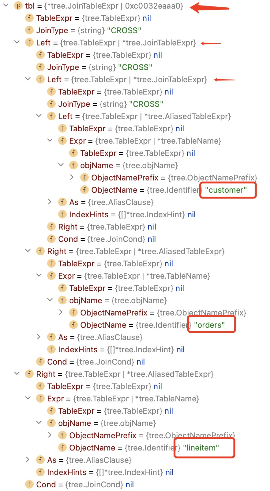

# 第二章 多表

讲tpch q3的plan构造过程和数据结构。

这里不再赘述q3构建过程中与q1相同的部分，详见[第一章](./ch1.md)。

这理只介绍构建过程中不同的地方。

q3 3张表，无子查询，有聚合函数，有groupby和orderby，有过滤条件。

```sql
select
    l_orderkey,
    sum(l_extendedprice * (1 - l_discount)) as revenue,
    o_orderdate,
    o_shippriority
from
    customer,
    orders,
    lineitem
where
    c_mktsegment = 'HOUSEHOLD'
    and c_custkey = o_custkey
    and l_orderkey = o_orderkey
    and o_orderdate < date '1995-03-29'
    and l_shipdate > date '1995-03-29'
group by
    l_orderkey,
    o_orderdate,
    o_shippriority
order by
    revenue desc,
    o_orderdate
limit 10
;
```

## 生成JOIN节点

### AST形式

先是customer与orders连接，再与lineitem连接。

```lisp
(join (join customer orders) lineitem)
```



### 合并Binding

考察对tree.JoinTableExpr的构建过程。

新建两个BindContext：leftCtx和rightCtx。

用buildTable和leftCtx,rightCtx对左右两个表分别构建TableScan节点。

依次将leftCtx和rightCtx合并到当前的context中。

mergeContext做这步工作。

```go
func (bc *BindContext) mergeContexts(left, right *BindContext) error
```

- 将leftCtx的binding合并到当前context.bindings,bindingByTag,bindingByTable,bindingByCol

- 将rightCtx的binding合并到当前context.bindings,bindingByTag,bindingByTable,bindingByCol

- 重名表和重名列会报错

### 小结

对两两表的连接，分别构建table_scan节点，合并binding，再生成join节点。

## 下推filter

### JOIN节点下推

用enumerateTags收集子节点的引用的binding tag。

分左右子节点。

用getJoinSide判断filter用到了左节点的binding tag，右节点的binding tag，还是两边都用到了。（JoinSideLeft，JoinSideNone，JoinSideRight，JoinSideBoth）

依据每个filter的joinSide类型，对filter不同的下推方案：

- JoinSideBoth。不下推。

- JoinSideLeft。向左节点下推。

- JoinSideRight。向右节点下推。

- JoinSideNone。根据JoinType类型，再决定是左节点下推，右节点下推，还是不下推。

递归对左子节点下推应该向左子节点下推的filter。

对左子节点返回不能下推的表达式，新增filter节点。

递归对右子节点下推应该向右子节点下推的filter。

对右子节点返回不能下推的表达式，新增filter节点。

### 小结

join节点下推，对filter分左右子节点。

## 重映射列引用

### JOIN节点

对on条件OnList的增加全局引用计数。

递归对左子节点进行列引用重映射。得到左子节点返回的列引用变更leftRemapping。

递归对右子节点进行列引用重映射。得到右子节点返回的列引用变更rightRemapping。

将leftRemapping,rightRemapping合并到internalMap。

对on条件OnList减少全局引用计数，并用internalMap对OnList中的表达式进行列引用重映射。

生成节点的projectList。

- 用左子节点的projectlist生成新的投影表达式。leftRemapping中引用计数不为0的保存到要返回的remapping中。

- joinType不是SEMI也不是ANT时， 用右子节点的projectlist生成新的投影表达式。rightRemapping中引用计数不为0的保存到要返回的remapping中。

### 小结

对左右子节点递归重引用。后序遍历合并变更的列引用和生成新的projectlist。

## JOIN定序

多表join时，要根据表的基数(card)和选择系数(selectRate)调整join的执行顺序。

```go
func (qb *QueryBuilder) determineJoinOrder(nodeID int32) int32 {
```

函数返回定序后的树根节点的ID。

这块代码没有什么注释，也不知道参考的是哪篇论文。

从代码仅能分析逻辑思路，但是无法断定算法本来面目。这需要后续深入。

对innerjoin进行后续处理，其它情况递归处理。

### 收集叶子节点和join-on条件

```go
func (builder *QueryBuilder) gatherJoinLeavesAndConds(joinNode *plan.Node, leaves []*plan.Node, conds []*plan.Expr) ([]*plan.Node, []*plan.Expr)
```

对innerjoin进行递归调用。join-on条件就是节点onList。

对非innerjoin，对节点递归调用determineJoinOrder定序，定序后的节点作为叶子。

### 构造JOIN图

```go
func (builder *QueryBuilder) getJoinGraph(leaves []*plan.Node, conds []*plan.Expr) []*joinVertex 
```

#### 建立顶点

对每个叶子节点，构造一个图顶点。对于tableScan节点，还在顶点中增加主键列名列表。

顶点的card = 叶子节点的card。

顶点的选择系数pkSelRate = 1.0

顶点还有parent和children字段表示父子关系。

实际上构建的是棵树，树也是一种图。

对于节点上的filterList，包含主键列名列表时，要缩小plSelRate。

#### 建立边

（这块条件很细，这挑关键的。）

- 对于等值连接两端列引用涉及的顶点，还没有与其它顶点建立边。

- 如果左顶点使用的列引用列表包含左顶点的主键列名列表，那么左顶点是右顶点的子节点。

- 如果右顶点使用的列引用列表包含右顶点的主键列名列表，那么右顶点是左顶点的子节点。

### 构造JOIN森林

对于图顶点parent为-1的顶点，用函数buildSubJoinTree构建一颗子树。

```go
func (builder *QueryBuilder) buildSubJoinTree(vertices []*joinVertex, vid int32)
```

buildSubJoinTree基于DFS。

- 先对每个child顶点递归调用构建子树。child顶点收集到dimensions。dimensions中是每个child顶点的子树。

- 对dimensions按照<pkSelRate,card> 字典序排序。

- 对dimensions构建一个leftdeep树。最左叶子节点是进入buildSubJoinTree的顶点。

通过buildSubJoinTree会构造出一棵棵子树，形成森林subTrees。

对subTrees按照card递增排序。

### 构建最终的JOIN

对subTrees的size构建图的邻接矩阵adjMat。

对join-on条件，表达式中列引用所用到的subTree序号保存下来。两两序号之间adjMat(i,j)=true。adjMat是个无向图。

如果adjMat存在true的情况，那么从为true的最小的序号firstConnected开始对adjMat表达的图进行DFS遍历。

- 在DFS遍历过程中，构建leftdeep树。新节点的左子节点，是前一棵树。初始化是firstConnected顶点的节点。新节点的右子节点，是左子节点在adjMat中未被访问过的且为true的邻接顶点。

- 在adjMat中剩余未被连通的subTree，再接到前一步的leftDeep之上。

如果adjMat没有true的情况，说明subTree之间没有连通边。直接对subTrees从左向右构建leftDeep树。

在新树上，下推join-on条件。

### 小结

join定序的算法，需要找到参考的论文。
