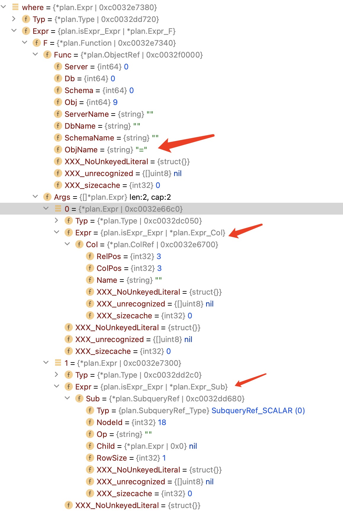

# 第三章 子查询展开

讲tpch q2的构建过程。

q2 多表+where中的相关子查询。

构造过程跟q1,q3有重叠的部分，详见[第一章](./ch1.md)，[第二章](./ch2.md)。

这里只介绍子查询展开部分。

```sql
select
    s_acctbal,
    s_name,
    n_name,
    p_partkey,
    p_mfgr,
    s_address,
    s_phone,
    s_comment
from
    part,
    supplier,
    partsupp,
    nation,
    region
where
    p_partkey = ps_partkey
    and s_suppkey = ps_suppkey
    and p_size = 48
    and p_type like '%TIN'
    and s_nationkey = n_nationkey
    and n_regionkey = r_regionkey
    and r_name = 'MIDDLE EAST'
    and ps_supplycost = (
        select
            min(ps_supplycost)
        from
            partsupp,
            supplier,
            nation,
            region
        where
            p_partkey = ps_partkey
            and s_suppkey = ps_suppkey
            and s_nationkey = n_nationkey
            and n_regionkey = r_regionkey
            and r_name = 'MIDDLE EAST'
    )
order by
    s_acctbal desc,
    n_name,
    s_name,
    p_partkey
limit 100;
```

相关子查询条件：

p_partkey是表part的字段，在外部查询中。

ps_partkey在子查询表partsup中。

```sql
...
where
            p_partkey = ps_partkey
...
```

## AST形式

q2中子查询部分：

```sql
...
and ps_supplycost = (
        select
            min(ps_supplycost)
        from
...
)
```

形成的ast:



## 子查询展开

```go
func (qb *QueryBuilder) flattenSubquery(nodeID int32, subquery *plan.SubqueryRef, ctx *BindContext) (int32, *plan.Expr, error) {
```

此函数完成子查询的展开：

- 将关联filter拉到外部查询。

- 子查询拉到外部节点变成join。

- 子查询表达式中Expr_Sub改写为普通列引用。

### 上拉关联filter

子查询中的where条件p_partkey = ps_partkey含有关联字段，需要上拉。where中的其它filter不需要动。

```go
func (builder *QueryBuilder) pullupCorrelatedPredicates(nodeID int32, ctx *BindContext) (int32, []*plan.Expr, error) {
```

此函数完成关联filter上拉。

先递归调用从子节点上拉关联filter。

关联filter只会来自FILTER节点。在FILTER节点将关联filter从filterlist中拿掉，返回给父亲节点。

关联filter要拉到AGG节点之上时，对关联filter中的非关联列的引用改写。

```go
func (builder *QueryBuilder) pullupThroughAgg(ctx *BindContext, node *plan.Node, tag int32, expr *plan.Expr) *plan.Expr {
```

- 将非关联列引用放入node.groupby表达式列表中

- 将非关联列引用改写为对AGG节点的列引用

关联filter要拉到PROJECT节点之上时，对关联filter中的非关联列的引用改写。

```go
func (builder *QueryBuilder) pullupThroughProj(ctx *BindContext, node *plan.Node, tag int32, expr *plan.Expr) *plan.Expr {
```

- 将非关联列引用放入node.ProjectList表达式列表中

- 将非关联列引用改写为对PROJECT节点的列引用

### 降低关联列引用的深度

将关联filter中的关联列引用depth减去1。

```go
func decreaseDepthAndDispatch(preds []*plan.Expr) ([]*plan.Expr, []*plan.Expr) {
```

- depth为0的关联列引用，变成普通列引用。构成join-on条件（所有的关联列引用深度都为0）。

- depth>0的关联列引用，单独拎出来，构建FILTER节点。

### 构建新JOIN节点

将子查询加到外部查询的JOIN部分。类似下面的形式。

```sql
...
from
    part,
    supplier,
    partsupp,
    nation,
    region,
    子查询节点
...
```

新JOIN节点的左子节点是外部查询的JOIN节点。上面的子查询节点前面的部分。

右子节点是子查询节点。

join-on条件是上一小节讲的降低深度后，变成普通列引用的表达式。

新增FILTER节点是上一下节讲的降低深度后，没有变成普通列引用的表达式。

而且join类型变成SINGLE JOIN，如果是单行结果，join类型是LEFT JOIN

### Expr_Sub改写为普通列引用

将下面的子查询表达式中的子查询部分，变成对子查询节点的投影列的引用。

Expr_Sub被替换为普通的列用Expr_Col。

```go
...
and ps_supplycost = (
        select
            min(ps_supplycost)
        from
...
)
```

## 小结

经过上面的步骤，q2的子查询被展开后，变成类似下面的sql。

```sql
select
    s_acctbal,
    s_name,
    n_name,
    p_partkey,
    p_mfgr,
    s_address,
    s_phone,
    s_comment
from
    part,
    supplier,
    partsupp,
    nation,
    region left join
    (
        select
            min(ps_supplycost) as minValue,ps_suppkey
        from
            partsupp,
            supplier,
            nation,
            region
        group by
            ps_suppkey
        where
            s_suppkey = ps_suppkey
            and s_nationkey = n_nationkey
            and n_regionkey = r_regionkey
            and r_name = 'MIDDLE EAST'
    ) as S on p_partkey = S.ps_partkey
where
    p_partkey = ps_partkey
    and s_suppkey = ps_suppkey
    and p_size = 48
    and p_type like '%TIN'
    and s_nationkey = n_nationkey
    and n_regionkey = r_regionkey
    and r_name = 'MIDDLE EAST'
    and ps_supplycost = S.minValue
order by
    s_acctbal desc,
    n_name,
    s_name,
    p_partkey
limit 100;
```

mo的子查询展开目前的实现方式与参考文献的上的不同，做了简化。
