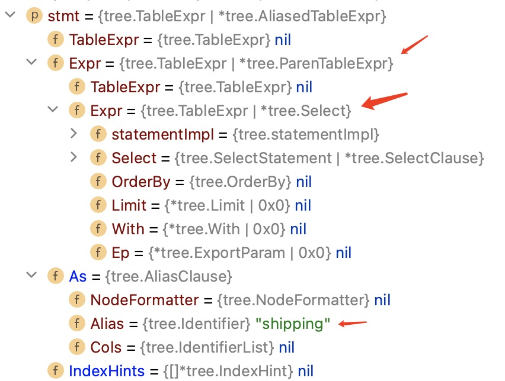
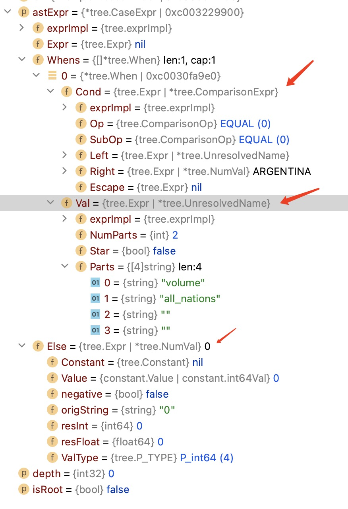

# 第4章 子查询展开（续）

## q4的子查询展开

q4中的子查询展开整体逻辑与q2相同。详见[第3章](./ch3.md)。

q4 单表，子查询，子查询中也是单表。

```sql
select
    o_orderpriority,
    count(*) as order_count
from
    orders
where
    o_orderdate >= date '1997-07-01'
    and o_orderdate < date '1997-07-01' + interval '3' month
    and exists (
        select
            *
        from
            lineitem
        where
            l_orderkey = o_orderkey
            and l_commitdate < l_receiptdate
    )
group by
    o_orderpriority
order by
    o_orderpriority
;
```

与q2的不同点：

- 子查询中投影表达式为*

- 子查询表达式为exists。

### *的展开

由此函数完成*展开。

```go
func (bc *BindContext) doUnfoldStar(root *BindingTreeNode, visitedUsingCols map[string]any, exprs *[]tree.SelectExpr, names *[]string) {
```

子查询中仅有单表lineitem。*直接展开为其全部列。

### 构建新JOIN

关联filter`l_orderkey = o_orderkey`上拉后。o_orderkey变成普通列引用。

exists改写为SEMI-JOIN。

semi-join的意思是：left semi-join right

semi-join的结果只有left部分的记录。通常是exists和in 的查询改写后的结果。

### 小结

q4的子查询展开后，变成类似下面的形式。

```sql
select
    o_orderpriority,
    count(*) as order_count
from
    orders semi-join (
        select
            *
        from
            lineitem
        group by 
            l_orderkey
        where
            l_commitdate < l_receiptdate
    ) as Sub on Sub.l_orderkey = o_orderkey
where
    o_orderdate >= date '1997-07-01'
    and o_orderdate < date '1997-07-01' + interval '3' month
group by
    o_orderpriority
order by
    o_orderpriority
;
```

## q7

q7的子查询没有关联部分。子查询在FROM子句后面，作为单独一张表，表名为shipping。

既然没有关联部分，就不需要做子查询展开。

q7整体构建过程与没有子查询的单表查询 没区间。

```sql
select
    supp_nation,
    cust_nation,
    l_year,
    sum(volume) as revenue
from
    (
        select
            n1.n_name as supp_nation,
            n2.n_name as cust_nation,
            extract(year from l_shipdate) as l_year,
            l_extendedprice * (1 - l_discount) as volume
        from
            supplier,
            lineitem,
            orders,
            customer,
            nation n1,
            nation n2
        where
            s_suppkey = l_suppkey
            and o_orderkey = l_orderkey
            and c_custkey = o_custkey
            and s_nationkey = n1.n_nationkey
            and c_nationkey = n2.n_nationkey
            and (
                (n1.n_name = 'FRANCE' and n2.n_name = 'ARGENTINA')
                or (n1.n_name = 'ARGENTINA' and n2.n_name = 'FRANCE')
            )
            and l_shipdate between date '1995-01-01' and date '1996-12-31'
    ) as shipping
group by
    supp_nation,
    cust_nation,
    l_year
order by
    supp_nation,
    cust_nation,
    l_year
;
```

### 构建FROM子句

子查询在FROM子句中。ast形式。



不再是tree.TableName类型，而是tree.Select类型。

因此，在buildTable里面增加处理tree.Select的逻辑。

新建Bindcontext，调用buildSelect构建子查询。

之后，调用addBinding将子查询的投影列作为binding添加到外层查询的Bindcontext.binding中。

### 构建AND，OR 表达式

q7多了and 和 or 表达式。

函数qualifyColumnNames增加对and和or表达式列引用的规范化。

函数baseBindExpr增加对and和or表达式的构建。

### 小结

q7子查询没有关联列，简化了逻辑。新增了FROM子句中的查询构建。

## q8

q8的子查询没有关联部分。子查询在FROM子句后面，作为单独一张表，表名为all_nations。

q8的构建过程与q7类似。q8比q7多了个CASE语句。

```sql
select
    o_year,
    (sum(case
        when nation = 'ARGENTINA' then volume
        else 0
    end) / sum(volume)) as mkt_share
from
    (
        select
            extract(year from o_orderdate) as o_year,
            l_extendedprice * (1 - l_discount) as volume,
            n2.n_name as nation
        from
            part,
            supplier,
            lineitem,
            orders,
            customer,
            nation n1,
            nation n2,
            region
        where
            p_partkey = l_partkey
            and s_suppkey = l_suppkey
            and l_orderkey = o_orderkey
            and o_custkey = c_custkey
            and c_nationkey = n1.n_nationkey
            and n1.n_regionkey = r_regionkey
            and r_name = 'AMERICA'
            and s_nationkey = n2.n_nationkey
            and o_orderdate between date '1995-01-01' and date '1996-12-31'
            and p_type = 'ECONOMY BURNISHED TIN'
    ) as all_nations
group by
    o_year
order by
    o_year
;
```

### 构建CASE表达式

q8的CASE的AST形式。

函数qualifyColumnNames增加对CASE表达式列引用的规范化。

函数baseBindExpr增加对CASE表达式的构建。



### 小结

q8比q7多了个CASE语句。

## q9

q9的子查询没有关联部分。子查询在FROM子句后面，作为单独一张表，表名为profit。

q9的构建过程与q7，q8类似。而且没有增加新的表达式。

这里就不再赘述。

```sql
select
    nation,
    o_year,
    sum(amount) as sum_profit
from
    (
        select
            n_name as nation,
            extract(year from o_orderdate) as o_year,
            l_extendedprice * (1 - l_discount) - ps_supplycost * l_quantity as amount
        from
            part,
            supplier,
            lineitem,
            partsupp,
            orders,
            nation
        where
            s_suppkey = l_suppkey
            and ps_suppkey = l_suppkey
            and ps_partkey = l_partkey
            and p_partkey = l_partkey
            and o_orderkey = l_orderkey
            and s_nationkey = n_nationkey
            and p_name like '%pink%'
    ) as profit
group by
    nation,
    o_year
order by
    nation,
    o_year desc
;
```

### 小结

q9相比于q8，q7没有新增特别的内容。

## q11

q11是HAVING子句中有子查询。而且没有关联列。

q2是WHERE子句中有子查询。

q11构建过程与q2相同。没有关联列就无需上拉FILTER。这里不再赘述。

```sql
select
    ps_partkey,
    sum(ps_supplycost * ps_availqty) as value
from
    partsupp,
    supplier,
    nation
where
    ps_suppkey = s_suppkey
    and s_nationkey = n_nationkey
    and n_name = 'JAPAN'
group by
    ps_partkey having
        sum(ps_supplycost * ps_availqty) > (
            select
                sum(ps_supplycost * ps_availqty) * 0.0001000000
            from
                partsupp,
                supplier,
                nation
            where
                ps_suppkey = s_suppkey
                and s_nationkey = n_nationkey
                and n_name = 'JAPAN'
        )
order by
    value desc
;
```

### 小结

q11的子查询在having子句中。构建方法与q2相同。

## q13

q13子查询在FROM子句中，做为单表。无关联列，类似q7。

q13构建过程整体与q7类似。

q13有LEFT JOIN ... ON。以及NOT LIKE

```sql
select
    c_count,
    count(*) as custdist
from
    (
        select
            c_custkey,
            count(o_orderkey)
        from
            customer left outer join orders on
                c_custkey = o_custkey
                and o_comment not like '%pending%accounts%'
        group by
            c_custkey
    ) as c_orders (c_custkey, c_count)
group by
    c_count
order by
    custdist desc,
    c_count desc
;
```

### 构建LEFT JOIN ... ON

函数buildJoinTable对On条件构建。用TableBinder来构建ON条件。

TableBinder是baseBinder的包装。

ON构建后的表达式，放入node.OnList中。

在FILTER下推是，函数pushdownFilters中，对LEFT JOIN的OnList进行下推。

跟join左边无关的filter可以下推。q13中的`o_comment not like '%pending%accounts%'`就可以下推。

### 改写NOT LIKE

改写为LIKE表达式的逻辑反。即NOT（LIKE ...)。

### 小结

q13有left join on。

## q15

q15有CTE，CTE用在外层查询的FROM子句。

WHERE子句有子查询，子查询中用了CTE。但不是关联子查询。

```sql
with q15_revenue0 as (
    select
        l_suppkey as supplier_no,
        sum(l_extendedprice * (1 - l_discount)) as total_revenue
    from
        lineitem
    where
        l_shipdate >= date '1995-12-01'
        and l_shipdate < date '1995-12-01' + interval '3' month
    group by
        l_suppkey
    )
select
    s_suppkey,
    s_name,
    s_address,
    s_phone,
    total_revenue
from
    supplier,
    q15_revenue0
where
    s_suppkey = supplier_no
    and total_revenue = (
        select
            max(total_revenue)
        from
            q15_revenue0
    )
order by
    s_suppkey
;
```

### 构建CTE

CTE有一个特性是，后面的CTE能引用前面的CTE。

CTE是转变成子查询来实现的。

在函数buildSelect的开头处，先倒序分析CTE，生成CTERef，并放入BindContext.cteByName字段。

对CTE用构建子查询的方式，构建一遍CTE，但是不记录构建结果，用来验证CTE是否可构建。

在用CTE作为表时，会到BindContext.cteByName中找到CTE，然后类似与用FROM后子查询一样的方式，使用CTE的构建结果。

### 小结

q15将CTE用在FROM子句中。

## q16

q16的子查询用在NOT IN 中。不是关联子查询。

NOT IN子查询 翻译成ANTI-JOIN。

```sql
select
    p_brand,
    p_type,
    p_size,
    count(distinct ps_suppkey) as supplier_cnt
from
    partsupp,
    part
where
    p_partkey = ps_partkey
    and p_brand <> 'Brand#35'
    and p_type not like 'ECONOMY BURNISHED%'
    and p_size in (14, 7, 21, 24, 35, 33, 2, 20)
    and ps_suppkey not in (
        select
            s_suppkey
        from
            supplier
        where
            s_comment like '%Customer%Complaints%'
    )
group by
    p_brand,
    p_type,
    p_size
order by
    supplier_cnt desc,
    p_brand,
    p_type,
    p_size
;
```

### 展开NOT IN子查询

q16没有关联FILTER，不需要上拉FILTER。

ANTI JOIN的左节点是partsupp 和 part 的JOIN节点，右节点是NOT IN子查询。

NOT IN表达式改写为`=`表达式，左边是ps_suppkey，右边是子查询。

q16在JOIN定序之后，会下推ANTI JOIN节点。

`func (qb *QueryBuilder) pushdownSemiAntiJoins(nodeID int32) int32`

从ANTI JOIN节点的左子节点开始，能持续往下推的条件有两个：

- JOIN节点并且（JOIN TYPE为INNER或LEFT)

- ANT JOIN ON 条件中要么有左子节点，要么有右子节点的列名引用。

找到目标节点targetNode后，将ANTI JOIN插入targetNode与其子节点之间。

### 小结

NOT IN改写为ANTI JOIN节点。下推ANTI JOIN节点。

## q17

q17 关联子查询。构建过程与q2相同。

```sql
select
    sum(l_extendedprice) / 7.0 as avg_yearly
from
    lineitem,
    part
where
    p_partkey = l_partkey
    and p_brand = 'Brand#54'
    and p_container = 'LG BAG'
    and l_quantity < (
        select
            0.2 * avg(l_quantity)
        from
            lineitem
        where
            l_partkey = p_partkey
    );
```

## q18

有子查询，但不是关联子查询。

IN子查询 改写为SEMI JOIN。构建过程上与q16的区别在不是ANTI JOIN。

而下推SEMI JOIN和ANTI JOIN的方式相同。

```sql
select
    c_name,
    c_custkey,
    o_orderkey,
    o_orderdate,
    o_totalprice,
    sum(l_quantity)
from
    customer,
    orders,
    lineitem
where
    o_orderkey in (
        select
            l_orderkey
        from
            lineitem
        group by
            l_orderkey having
                sum(l_quantity) > 314
    )
    and c_custkey = o_custkey
    and o_orderkey = l_orderkey
group by
    c_name,
    c_custkey,
    o_orderkey,
    o_orderdate,
    o_totalprice
order by
    o_totalprice desc,
    o_orderdate
limit 100
;
```

### 小结

IN子查询 改写为SEMI JOIN。

## q20

q20两层子查询，

第一层`s_suppkey in ...`。非关联子查询。

在第一层里面，嵌套了第二层子查询

第二层有两个子查询。

- `ps_partkey in ...`。非关联子查询。

- `ps_availqty > ...`。关联子查询，关联到第一层子查询。

IN 子查询 的改写在前文出现过。

关联子查询的展开也在前文出现过。

q20的构建过程与前文的内容相同，子查询嵌套子查询，更复杂。

```sql
select
    s_name,
    s_address
from
    supplier,
    nation
where
    s_suppkey in (
        select
            ps_suppkey
        from
            partsupp
        where
            ps_partkey in (
                select
                    p_partkey
                from
                    part
                where
                    p_name like 'lime%'
            )
            and ps_availqty > (
                select
                    0.5 * sum(l_quantity)
                from
                    lineitem
                where
                    l_partkey = ps_partkey
                    and l_suppkey = ps_suppkey
                    and l_shipdate >= date '1993-01-01'
                    and l_shipdate < date '1993-01-01' + interval '1' year
            )
    )
    and s_nationkey = n_nationkey
    and n_name = 'VIETNAM'
order by s_name
;
```

### 小结

子查询中嵌套子查询。

## q21

有EXISTS和NOT EXISTS 两种关联子查询。

NOT EXISTS表达式改写为ANTI JOIN。

```sql
select
    s_name,
    count(*) as numwait
from
    supplier,
    lineitem l1,
    orders,
    nation
where
    s_suppkey = l1.l_suppkey
    and o_orderkey = l1.l_orderkey
    and o_orderstatus = 'F'
    and l1.l_receiptdate > l1.l_commitdate
    and exists (
        select
            *
        from
            lineitem l2
        where
            l2.l_orderkey = l1.l_orderkey
            and l2.l_suppkey <> l1.l_suppkey
    )
    and not exists (
        select
            *
        from
            lineitem l3
        where
            l3.l_orderkey = l1.l_orderkey
            and l3.l_suppkey <> l1.l_suppkey
            and l3.l_receiptdate > l3.l_commitdate
    )
    and s_nationkey = n_nationkey
    and n_name = 'BRAZIL'
group by
    s_name
order by
    numwait desc,
    s_name
limit 100
;
```

### 构建 EXISTS和NOT EXISTS 表达式

EXISTS表达式在前文中讲过。

1，规范化列名引用。函数qualifyColumnNames增加对NOT EXISTS表达式的处理。

2，bind列名引用。函数baseBindExpr增加对NOT EXISTS表达式的处理。

NOT EXISTS 表达式 改写为ANTI JOIN节点。

### 小结

NOT EXISTS表达式引入的关联子查询。


## q22

有两层子查询。

第一层 子查询放到FROM子句中。

第二层

- `c_acctbal >`。非关联子查询。

- `not exists `。关联子查询，关联到第一层子查询。

构建q22用到的方法，在前文都有覆盖到。

```sql
select
	cntrycode,
	count(*) as numcust,
	sum(c_acctbal) as totacctbal
from
	(
		select
			substring(c_phone from 1 for 2) as cntrycode,
			c_acctbal
		from
			customer
		where
			substring(c_phone from 1 for 2) in
				('10', '11', '26', '22', '19', '20', '27')
			and c_acctbal > (
				select
					avg(c_acctbal)
				from
					customer
				where
					c_acctbal > 0.00
					and substring(c_phone from 1 for 2) in
						('10', '11', '26', '22', '19', '20', '27')
			)
			and not exists (
				select
					*
				from
					orders
				where
					o_custkey = c_custkey
			)
	) as custsale
group by
	cntrycode
order by
	cntrycode
;

```


### 小结

两层子查询。嵌套子查询。
